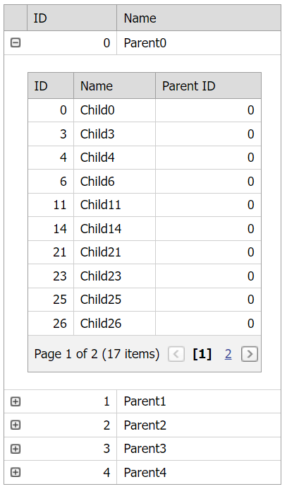

<!-- default badges list -->

[](https://supportcenter.devexpress.com/ticket/details/E5018)
[](https://docs.devexpress.com/GeneralInformation/403183)
[](#does-this-example-address-your-development-requirementsobjectives)
<!-- default badges end -->
# Grid View for ASP.NET Web Forms - How to implement the master-detail functionality with list data sources

This example demonstrates how to create `List` data sources and bind master and detail grids to those data sources.



## Overview

Create a [List](https://learn.microsoft.com/en-us/dotnet/api/system.collections.generic.list-1?view=net-7.0) data source for a master grid with an `ID` field. Then create a [List](https://learn.microsoft.com/en-us/dotnet/api/system.collections.generic.list-1?view=net-7.0) data source for detail grids. The detail data source contains two fields: `ID` and `ParentID`. The `ParentID` field corresponds to the master data source's `ID` field.

```cs
public static List<Parent> CreateMasterData(int masterRowCount) {
    List<Parent> parentList = new List<Parent>();
    for (int i = 0; i < masterRowCount; i++) {
        parentList.Add(new Parent() {
            ID = i,
            Name = "Parent" + i.ToString()
        });
    }
    return parentList;
}

public static List<Child> CreateChildData(int childRowCount, int maxMasterIndex) {
    List<Child> childList = new List<Child>();
    Random r = new Random();
    for (int i = 0; i < childRowCount; i++) {
        childList.Add(new Child() {
            ID = i,
            Name = "Child" + i.ToString(),
            ParentID = r.Next(maxMasterIndex)
        });
    }
    return childList;
}
```

In the page's `Init` handler, bind the master grid to its data source. In the detail grid's server-side [BeforePerformDataSelect](https://docs.devexpress.com/AspNet/DevExpress.Web.ASPxGridBase.BeforePerformDataSelect) event handler, get the master row's key value (the master data source's `ID` field) and filter detail data based on this value (the detail data source's `ParentID` field). Bind the detail grid to the filtered detail data source.

```cs
protected void Page_Init(object sender, EventArgs e) {
    masterGrid.DataSource = ParentData;
    masterGrid.DataBind();
}

protected void detailGrid_BeforePerformDataSelect(object sender, EventArgs e) {
    ASPxGridView detailGrid = (ASPxGridView)sender;
    int id = (int)detailGrid.GetMasterRowKeyValue();
    var result = from q in ChildData
                    where q.ParentID == id
                    select q;
    detailGrid.DataSource = result;
}
```

## Files to Review

* [Data.cs](./CS/Data.cs) (VB: [Data.vb](./VB/Data.vb))
* [Default.aspx](./CS/Default.aspx) (VB: [Default.aspx](./VB/Default.aspx))
* [Default.aspx.cs](./CS/Default.aspx.cs) (VB: [Default.aspx.vb](./VB/Default.aspx.vb))

## Documentation

* [Master-Detail Relationship](https://docs.devexpress.com/AspNet/3772/components/grid-view/concepts/master-detail-relationship)
<!-- feedback -->
## Does this example address your development requirements/objectives?

[](https://www.devexpress.com/support/examples/survey.xml?utm_source=github&utm_campaign=asp-net-web-forms-grid-bind-master-and-detail-grids-to-list-data-sources&~~~was_helpful=yes) [](https://www.devexpress.com/support/examples/survey.xml?utm_source=github&utm_campaign=asp-net-web-forms-grid-bind-master-and-detail-grids-to-list-data-sources&~~~was_helpful=no)

(you will be redirected to DevExpress.com to submit your response)
<!-- feedback end -->
